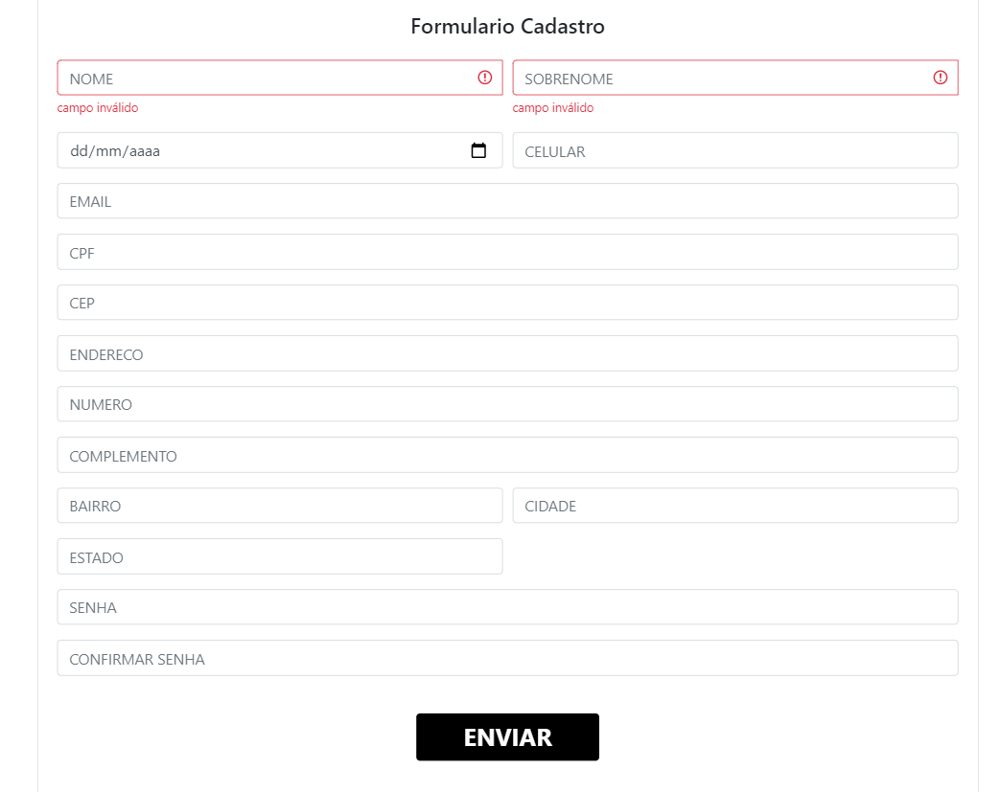

<h1>Resumo</h1>

    Neste projeto exemplifico como pode ser estruturado um formulário utilizando uma poderosa framwork chamada Angular. 
    Pode-se perceber com é simples fazer um formulário e suas devidas validações com angular. 

    <h1> quais libs utilizei ?</h1>
    layout : <strong>Bootstrap</strong> 
    mascara em inputs : <strong>ngx-mask</strong> 

link do projeto <a href="http://angular-reactive-forms-validation.vercel.app">http://angular-reactive-forms-validation.vercel.app</a>  

    

